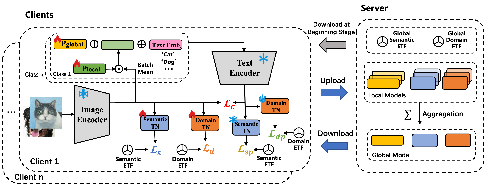

## FedDEAP: Adaptive Dual-Prompt Tuning for Multi-Domain Federated Learning

### 🧠 Overview

**FedDEAP** is an adaptive federated prompt-tuning framework built on **CLIP** for multi-domain image recognition. It introduces a **dual-prompt design** — a *global semantic prompt* for shared representations and a *local domain prompt* for personalized adaptation, together with **Equiangular Tight Frame (ETF)** constraints to construct unbiased and discriminative semantic/domain feature spaces.

<div left="center">
  
</div>

### 🛠️ Requirements

Please install the relevant environmental dependencies from the `requirements.txt` file.

### 🗂️ Datasets

* **DomainNet Dataset Download Link:** [https://ai.bu.edu/M3SDA/](https://ai.bu.edu/M3SDA/)
* **Offices Dataset Download Link:** [https://service.tib.eu/ldmservice/dataset/office-caltech-dataset](https://service.tib.eu/ldmservice/dataset/office-caltech-dataset)

### 📊 Get Results on PACS Dataset

Run the following command to get the results on the PACS dataset:

```bash
python federated.py --data=pacs --round=100 --data_path=PACS_split_data --batch_size=64 --lr=0.001 --device=cuda:0
```
### 📄 Cite Our Paper
```bash
@article{zheng2025feddeap,
  title={FedDEAP: adaptive dual-prompt tuning for multi-domain federated learning},
  author={Zheng, Yubin and Yeung, Pak Hei and Xia, Jing and Ju, Tianjie and Tang, Peng and Qiu, Weidong and Rajapakse, Jagath Chandana},
  year={2025},
  publisher={ACM}
}


